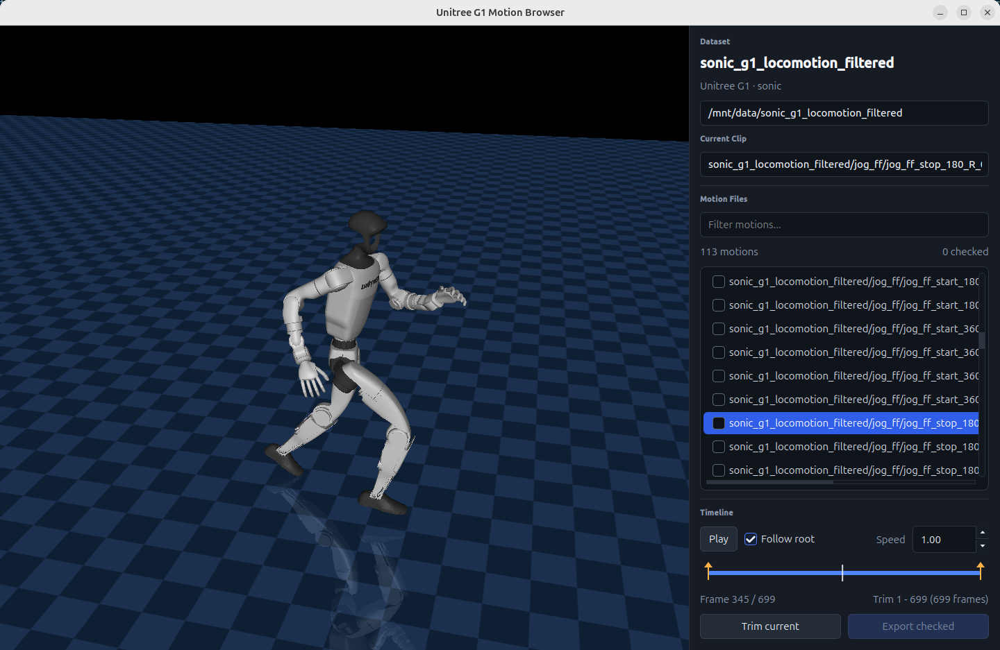

# motiondata-lib

`motiondata-lib` is a MuJoCo + PySide6 desktop tool for browsing humanoid motion datasets, previewing clips on a robot model, and exporting selected motions to a unified `.npz` format.



## Features

- Browse all motion files under a dataset directory, including nested subdirectories
- Filter the motion list by filename from the right-side panel
- Auto-detect supported dataset formats when a directory contains only one format
- Preview clips on a MuJoCo robot model with mouse camera control
- Play, pause, scrub frames, adjust playback speed, and optionally follow the root body
- Trim the current clip with timeline markers and export the selected span as `.npz`
- Batch-export checked clips to the project's standardized `.npz` layout

## Requirements

- Python 3.11+
- Linux desktop environment with OpenGL support
- `uv` for dependency management and reproducible runs

Python dependencies are declared in `pyproject.toml`:

- `mujoco`
- `numpy`
- `PySide6`

## Installation

Install `uv` first if it is not already available:

```bash
curl -LsSf https://astral.sh/uv/install.sh | sh
```

Create the environment and install project dependencies:

```bash
uv sync
```

On Ubuntu, install the Qt X11 runtime dependency before launching the GUI:

```bash
sudo apt install libxcb-cursor0
```

## Quick Start

```bash
uv run python main.py <dataset_dir> [--robot unitree_g1] [--format auto]
```

After launching, the GUI lets you filter motions by name, select a clip, move the current frame, drag trim markers on the timeline, and export either checked clips or the trimmed span of the current clip.

Command-line options:

- `dataset`: directory containing motion files of a single supported format
- `--robot`: robot profile name loaded from `robots/*.toml`
- `--model`: temporary URDF override for the selected robot profile
- `--format`: force one of `auto`, `retargeted_npz`, `sonic`, `lafan1`, `amass`

## Supported Robots

Robot profiles live in `robots/*.toml`. A profile defines:

- `name`
- `display_name`
- `model`
- `root_body`
- `joint_names`

Currently included:

- `unitree_g1` -> `robots/unitree_g1.toml`

The corresponding URDF and meshes are stored under `robots/resources/unitree_g1/`.

## Supported Dataset Formats

The browser currently supports four input formats. Internally, all of them are converted to the same `MotionClip` representation and can be exported as standardized `.npz`.

### 1. `retargeted_npz`

File suffix: `.npz`

Required arrays:

- `framerate`
- `joint_names`
- `joint_pos`
- `base_pos_w`
- `base_quat_w`

This is the project's canonical format and the export target.

### 2. `sonic`

File suffix: `.csv`

Expected header prefix:

- `Frame`
- `root_translateX`, `root_translateY`, `root_translateZ`
- `root_rotateX`, `root_rotateY`, `root_rotateZ`
- one `<joint_name>_dof` column for every joint in the selected robot profile

Importer behavior:

- root translation is interpreted in centimeters and converted to meters
- root rotation is interpreted as XYZ Euler angles in degrees
- joint angles are interpreted in degrees
- default frame rate is `120`

### 3. `lafan1`

File suffix: `.csv`

Expected numeric layout per frame:

- columns `0:3`: root position
- columns `3:7`: root quaternion in `xyzw`
- remaining columns: joint positions in robot-profile joint order

Default frame rate is `30`.

### 4. `amass`

File suffix: `.npy`

Expected numeric layout per frame:

- columns `0:3`: root position
- columns `3:7`: root quaternion in `xyzw`
- remaining columns: joint positions in robot-profile joint order

Importer behavior:

- frame rate is inferred from the last integer in the filename
- base `z` is shifted upward by `0.75`

## Development

Use `uv` for dependency and package management in this repository. Prefer:

```bash
uv add <package>
uv sync
uv run python main.py --help
uv run python -m py_compile main.py motiondata_lib/*.py motiondata_lib/importers/*.py
```

There is no committed `pytest` suite yet, so the main validation flow is currently import smoke tests and GUI startup checks.

## Extending the Project

### Add a New Robot

1. Add a new TOML profile under `robots/<name>.toml`
2. Put the URDF and assets under `robots/resources/<name>/`
3. Fill in `model`, `root_body`, and `joint_names`
4. Launch with:

```bash
uv run python main.py <dataset_dir> --robot <name>
```

Example profile:

```toml
name = "my_robot"
display_name = "My Robot"
model = "resources/my_robot/my_robot.urdf"
root_body = "pelvis"
joint_names = ["joint_a", "joint_b", "joint_c"]
```

### Add a New Dataset Importer

1. Create a new module under `motiondata_lib/importers/`
2. Define:
   - `FORMAT_NAME`
   - `can_load(path: Path) -> bool`
   - `load_motion_clip(clip_ref, robot_profile) -> MotionClip`
3. Register the importer in `motiondata_lib/importers/__init__.py`
4. Convert incoming data with `build_motion_clip(...)`

For new formats, the important contract is:

- output joint order must match `robot_profile.joint_names`
- root pose must be converted to `base_pos_w` and `base_quat_w`
- quaternions should be normalized before use

## Notes

- A dataset directory must contain only one supported input format when using `--format auto`
- Nested subdirectories are supported; they appear in the list as `subdir/file_name`
- Checked exports are written into a timestamped folder chosen from the GUI
